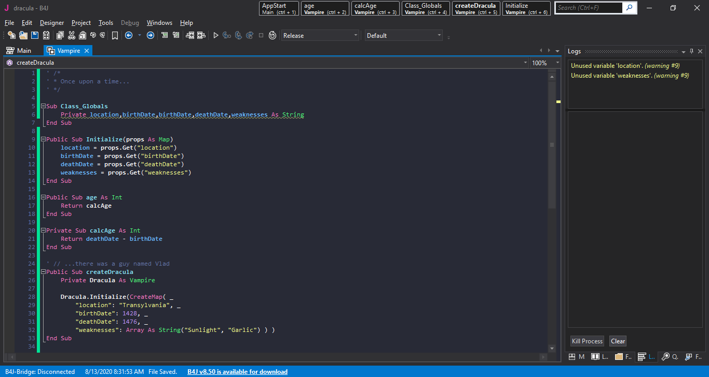
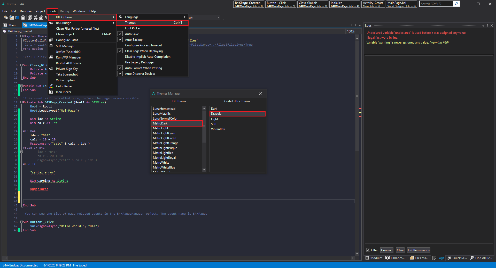

# Dracula for [B4X](https://www.b4x.com/)

> A dark theme for [B4X](https://www.b4x.com/).

## Install

All instructions can be found at [draculatheme.com/b4x](https://draculatheme.com/b4x).

A while ago, I discovered the Dracula theme for Visual Studio Code, I was enchanted by it, as it does not strain my eyes, if I work for a while with the brightness of the monitor high, my eyes are blurred, so after using the dracula theme I noticed that even though I spend hours in front of the computer, nothing happens to my eyes ...

So I decided to try to create something similar to the Dracula theme for our beloved B4X (the best development idea for me!)

Instructions on how to use the theme:

(1) Download the theme_dracula.zip file.

(2) Extract the Dracula.vssettings file inside the IDE's Themes folder.
Ex:
(B4A) C: \ Program Files (x86) \ Anywhere Software \ Basic4android \ Themes
(B4I) C: \ Program Files (x86) \ Anywhere Software \ B4i \ Themes
(B4J) C: \ Program Files (x86) \ Anywhere Software \ B4J \ Themes

(3) with the IDE open, open TOOLS> IDE OPTIONS> THEMES, or use CTRL + T to open the list of available themes.

(4) in IDE THEME, select MetroDark.

(5) in CODE EDITOR THEME, select Dracula.

## Team

This theme is maintained by the following person(s) and a bunch of [awesome contributors](https://github.com/dracula/template/graphs/contributors).

 |  | 
--- | --- | ---
[Harrison Heck](https://github.com/nesl247) | [Zeno Rocha](https://github.com/zenorocha) | [Lucas Siqueira](https://github.com/siqueirabt)

## License

[MIT License](./LICENSE)
